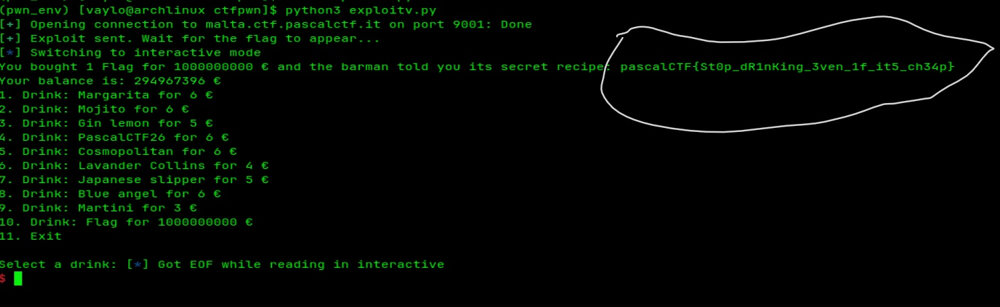

# Malta Nightlife - PascalCTF 2026

This was a classic bank-breaking challenge. You start with 100€, but the flag "drink" costs a billion. Obviously, we aren't going to earn that much legitimately.

### The Logic
Checking the binary in **Ghidra**, I saw that:
* The flag is loaded into the description of the 10th drink (index 9) at startup.
* To see that description, you actually have to buy the drink.
* Price: `1,000,000,000€`. My wallet: `100€`.

### The Bug: Integer Overflow
The vulnerability is in the cost calculation. The program uses signed 32-bit integers for the check:
`if ((int)balance < (int)(quantity * price))`

The max value for a signed 32-bit int is about **2.14 billion**. If you go over that, the number "wraps around" and becomes negative. 

### Exploitation
I needed the total cost to exceed 2.14 billion to trigger the flip.
1. I ordered **3 units** of the Flag drink. 
2. `3 * 1,000,000,000 = 3,000,000,000`.
3. In signed integer terms, 3 billion overflows and becomes **-1.29 billion**.
4. Since `100 < -1,290,000,000` is false, the program thinks I'm rich enough and lets the transaction slide.

Actually, subtracting a negative number from my balance gave me billions in credits. Absolute win.

### Getting the Flag
With my new infinite balance, I just bought 1 unit of drink #10. The program printed the "secret recipe," which was the flag.

**The Strategy:**
* **Step 1:** Order 3 of drink #10 (Overflow the cost to get infinite money).
* **Step 2:** Order 1 of drink #10 (Buy it for real to read the flag).

### Result:

heck out the full exploit script here: [exploit.py](./exploit.py)

**Flag caught.** 🚩
